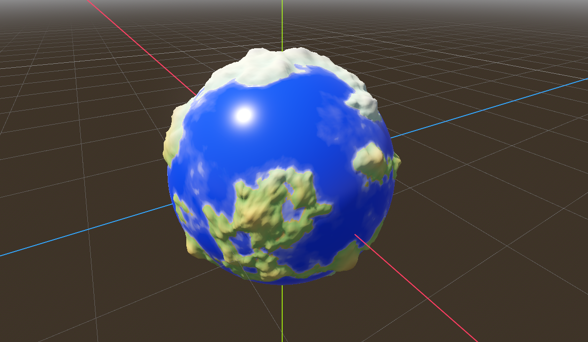
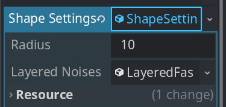
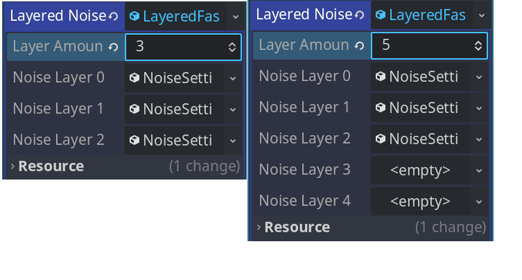
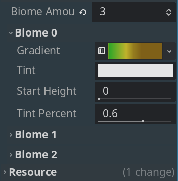

# Godot 程序化星球生成
使用gdscript实现[Sebastian Lague的程序化星球生成教程](https://www.youtube.com/watch?v=QN39W020LqU&list=PLFt_AvWsXl0cONs3T0By4puYy6GM22ko8)。噪音生成直接使用Godot内置的`FastNoiseLite`。

最终效果如下(网格分辨率为80，只设置了三个群落，没有细致地调参数)


教程的大部分内容在写编辑器插件。因此，总结了一下如何在Godot中实现类似的功能。

## 如何让编辑器中的参数立刻影响主屏幕中的场景
首先，需要添加`@tool`注解到场景节点的脚本上，这样脚本才能在编辑器中运行，对脚本的修改才可能反应到主屏幕上。其次，使用`@export`注解将需要调节的参数暴露到编辑器中。最后，为该参数添加一个`setter`方法，这样当参数被修改时，`setter`方法会被调用，从而实现参数的实时更新。

例如
```gdscript
# planet.gd
@export_range(2, 256) var resolution: int = 40:
    set(value):
        resolution = value
        # Godot初次调用export参数的setter函数时，节点还没有加入场景树，
        # 所以不要执行任何需要节点准备好的逻辑。
        if not is_inside_tree():
            return
        generate_meshes()
```

## 如何组织编辑器参数

### 使用 Resource
通过自定义`Resource`来组织参数，这样参数就能够保存为资源文件，并且可以在不同场景之间共享。最重要的是，在编辑器中export的参数有独立的可以展开/折叠的下拉框。



但想要在编辑器中修改自定义资源的参数，并立即生效，需要三个额外步骤：
1. 在自定义资源脚本中添加`@tool`注解。
2. 为自定义资源脚本中定义的参数中添加`@export`注解。设置`setter`方法，`setter`方法的内容出来基本的赋值操作外，需要多写一行`emit_changed()`。这个方法会通知外层持有该资源的脚本，资源被修改了。
3. 在持有资源的脚本中，链接自定义资源的`changed`信号，当资源被修改时，执行相应的逻辑。

例如
```gdscript
# shape_settings.gd
@tool
class_name ShapeSettings
extends Resource

@export var radius: float = 1.0:
    set(value):
        radius = value
        emit_changed()
@export var layered_noises: LayeredFastNoise:
    set(value):
        layered_noises = value
        if layered_noises and not layered_noises.is_connected("changed", emit_changed):
            layered_noises.changed.connect(emit_changed)

# planet.gd
func _ready() -> void:
    if shape_settings:
        shape_settings.changed.connect(generate_meshes)
```

另外，显然这种方式是支持嵌套的，需要注意在嵌套时，内层的`changed`信号要链接到外层的`changed`信号上，且内层的目标参数被修改时，要用`emit_changed()`发出`changed`信号。

### 使用 _get_property_list()
简单的参数推荐使用以上方法。对于一些更复杂的参数，则可以考虑使用`_get_property_list()`。例如
- 有一个数量参数，需要根据这个参数的实际值显示相同个数的额外参数。例如, `BiomeColorSettings`中的`biome_amount`， `LayeredFastNoise`中的`layer_amount`。
- 有一个布尔参数，如果为true，则显示一些额外的参数，反之，隐藏。例如`StandardMaterial3D`中的`emission, normal_map, rim`等参数。

#### 用 _get_property_list() 添加一个简单的float参数需要做什么？
1. 声明一个变量用于保存参数的值。
2. 在`_get_property_list()`方法返回的数组中添加一个字典，其中至少包含`name`和`type`两个键值对。
3. 在`_set()`方法中，处理该参数被设置时的行为(更新变量的值)
4. 在`_get()`方法中，决定请求该参数时，应该返回什么值。

```gdscript
# 需要一个存储实际数据的变量
var _my_float: float = 0.0

func _get_property_list() -> Array:
    return [{
        # 必须有name和type
        "name": "my_float", 
        "type": TYPE_FLOAT,
        # 其他可以省略
        "hint": PROPERTY_HINT_RANGE,
        "hint_string": "0,10,1",
        "usage": PROPERTY_USAGE_DEFAULT
    }]

func _set(property: String, value) -> bool:
    if property == "my_float":
        _my_float = value
        # 如果需要通知外层的脚本，参数被修改了，在这里调用
        # emit_changed()
        return true
    return false

func _get(property: String) -> Variant:
    if property == "my_float":
        return _my_float
```

#### 高阶用法
有一个数量参数，需要根据这个参数的实际值显示相同个数的额外参数。注意，需要使用`notify_property_list_changed()`通知编辑器，参数数量发生了变化，需要更新编辑器。

```gdscript
# layered_fast_noise.gd
@export var layer_amount: int = 0:
    set(value):
        layer_amount = value
        _noise_layers.resize(value)
        emit_changed()
        notify_property_list_changed()

# 用于存储参数值的变量
var _noise_layers: Array

func _get_property_list():
    var properties = []

    for i in range(layer_amount):
        properties.append({
            "name": "noise_layer_%d" % i,
            "type": TYPE_OBJECT,
            "hint": PROPERTY_HINT_RESOURCE_TYPE,
            "hint_string": "NoiseSettings",
        })
    return properties

func _get(property):
    if property.begins_with("noise_layer_"):
        var index = property.get_slice("_", 2).to_int()
        return _noise_layers[index]


func _set(property, value):
    if property.begins_with("noise_layer_"):
        var index = property.get_slice("_", 2).to_int()
        _noise_layers[index] = value
        if value and not value.is_connected("changed", emit_changed):
            value.changed.connect(emit_changed)
        return true

    return false
```

效果


#### 实现分组
`_get_property_list()`方法也可以得到类似@export_group()的效果。实现方法也很简单，只需要在参数名前加上`group_name/`即可。支持任意深度嵌套，如`outer_group_name/inner_group_name/your_param`。

例如
```gdscript
# biome_color_settings.gd
@export var biome_amount: int = 0:
    set(value):
        biome_amount = value
        _biome_settings.resize(value)
        for i in range(value):
            if _biome_settings[i] == null:
                _biome_settings[i] = [null, Color.BLACK, 0.0, 0.0]
        emit_changed()
        notify_property_list_changed()


func _get_property_list():
    var properties = []
    
    for i in range(biome_amount):
        properties.append({
            "name": "biome_%d/gradient" % i,
            "type": TYPE_OBJECT,
            "hint": PROPERTY_HINT_RESOURCE_TYPE,
            "hint_string": "Gradient",
        })
        properties.append({
            "name": "biome_%d/tint" % i,
            "type": TYPE_COLOR,
            "hint": PROPERTY_HINT_COLOR_NO_ALPHA,
        })
        properties.append({
            "name": "biome_%d/start_height" % i,
            "type": TYPE_FLOAT,
            "hint": PROPERTY_HINT_RANGE,
            "hint_string": "0,1,0.01",
        })
        properties.append({
            "name": "biome_%d/tint_percent" % i,
            "type": TYPE_FLOAT,
            "hint": PROPERTY_HINT_RANGE,
            "hint_string": "0,1,0.01",
        })

    return properties

func _get(property):
    if biome_amount > 0 and property.begins_with("biome_"):
        var index = property.get_slice("/", 0).get_slice("_", 1).to_int()
        var prop = property.get_slice("/", 1)
        match prop:
            "gradient":
                return _biome_settings[index][0]
            "tint":
                return _biome_settings[index][1]
            "start_height":
                return _biome_settings[index][2]
            "tint_percent":
                return _biome_settings[index][3]


func _set(property, value):
    if biome_amount > 0 and property.begins_with("biome_"):
        var index = property.get_slice("/", 0).get_slice("_", 1).to_int()
        var prop = property.get_slice("/", 1)
        match prop:
            "gradient":
                value.changed.connect(emit_changed)
                _biome_settings[index][0] = value
            "tint":
                _biome_settings[index][1] = value
            "start_height":
                _biome_settings[index][2] = value
            "tint_percent":
                _biome_settings[index][3] = value
        emit_changed()
        return true

    return false
```

效果


#### 使用_get_property_list()定义的参数
- 获取 get("defined_full_name")
- 设置 set("defined_full_name", value)

## 总结
1. 简单的参数，直接使用`@export`即可。
2. 参数比较复杂的，可以自定义资源。这种方法实现参数嵌套很方便。
2. `_get_property_list()`适合根据某个参数决定另外一些参数是否显示，显示多少。使用起来比较复杂，但在特定情况下是必须的。
